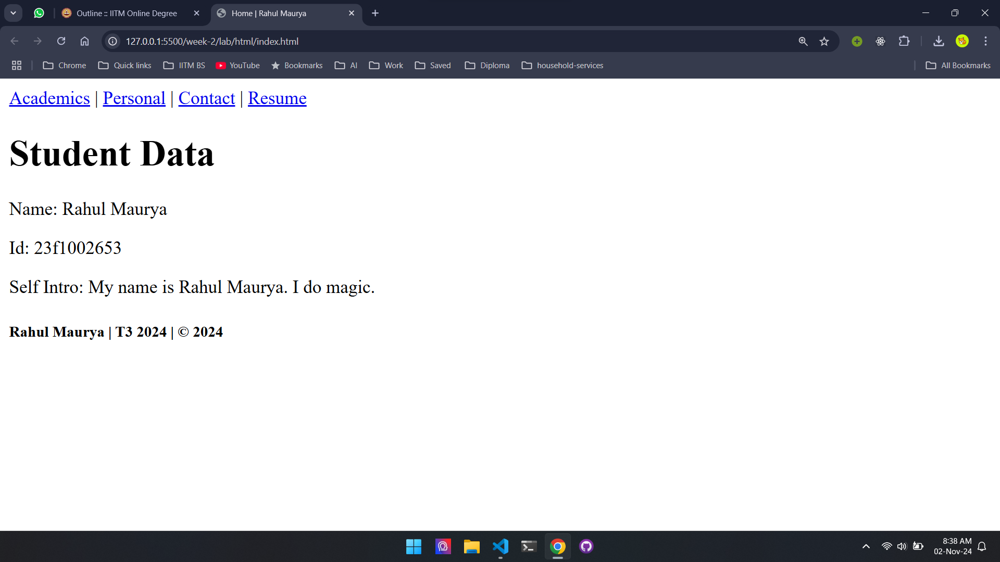
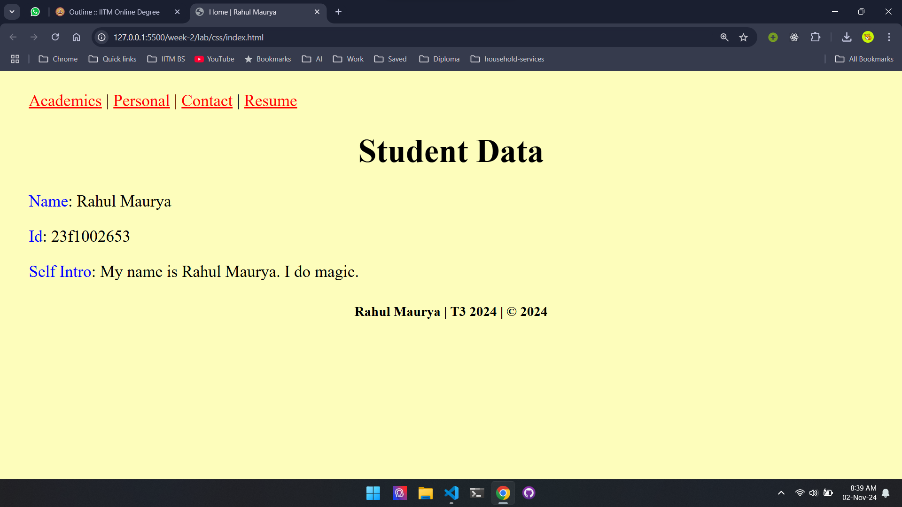
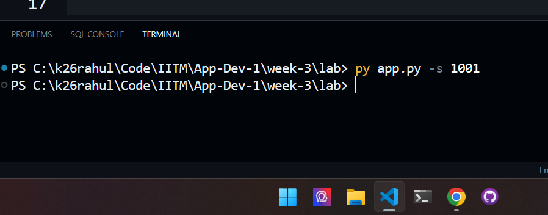
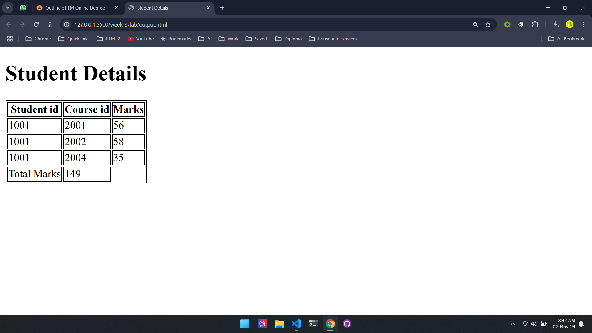
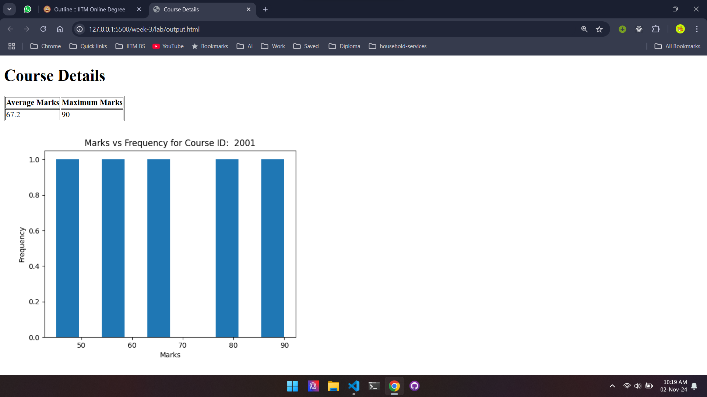
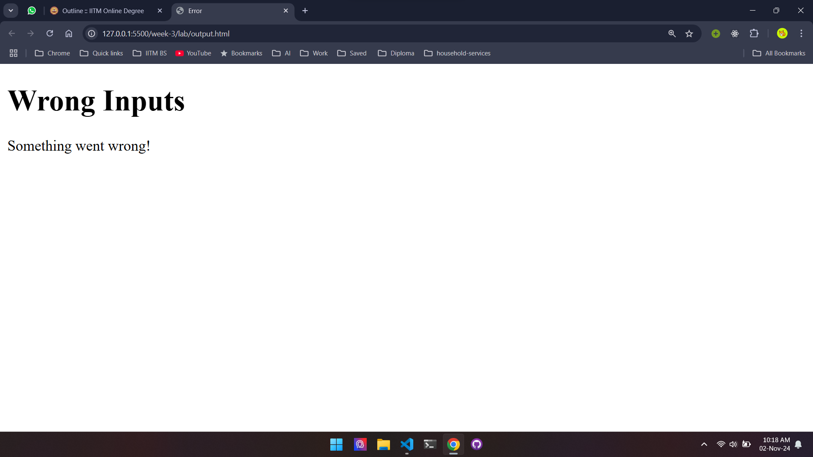
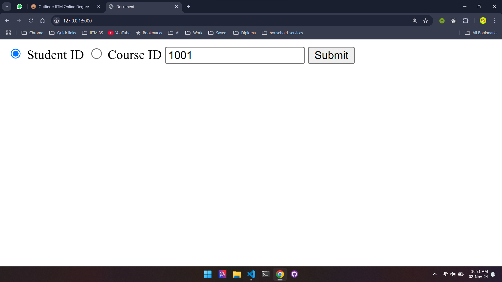
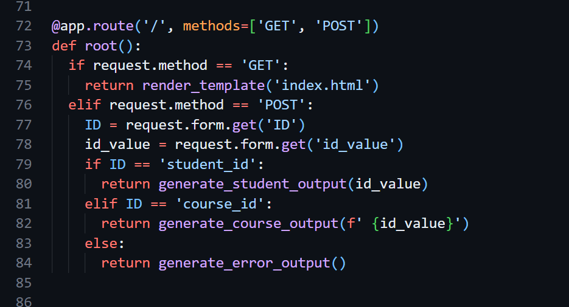

week 1 - app dev intro, how web works

week 2 - html, css, encoding (lab: 5 html pages)

week 3 - views, pyhtml, jinja2 (lab: app.py -s 1001)

week 4 - models, persistent storage, SQL (lab: flask app of week 3 lab)

week 5 - controllers, sqlalchemy, flask-sqlalchemy (lab: student, course, enrolls)

**week 2 html lab 👇**

**week 2 css lab 👇**

**week 3 lab (command) 👇**

**week 3 lab output.html for student 1001 👇**

**week 3 lab output.html for course 2001 👇**

**week 3 lab output.html for course 2005 (wrong inputs) 👇**

**week 4 lab (flask app of week 3 lab) 👇**

**week 4 lab (flask route '/') 👇**

